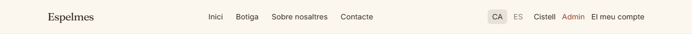
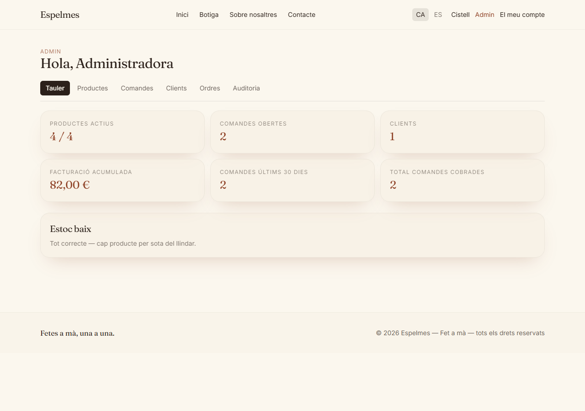
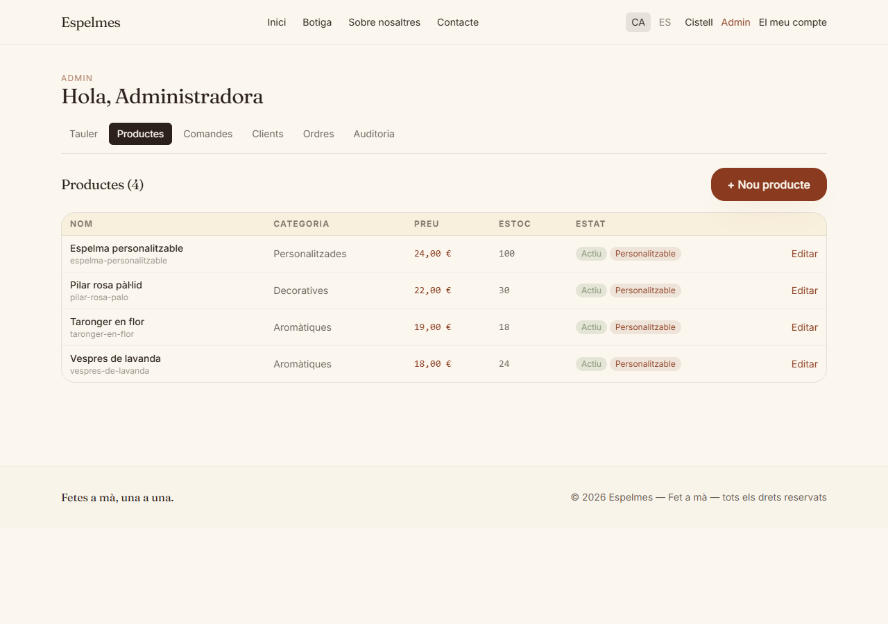
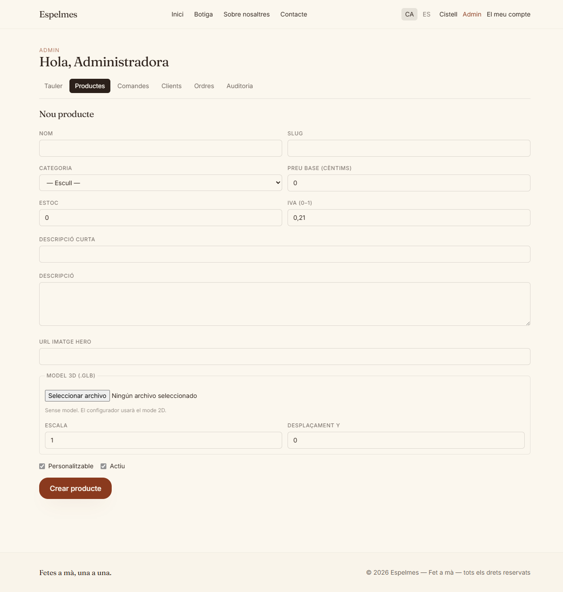
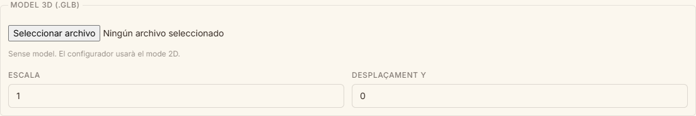
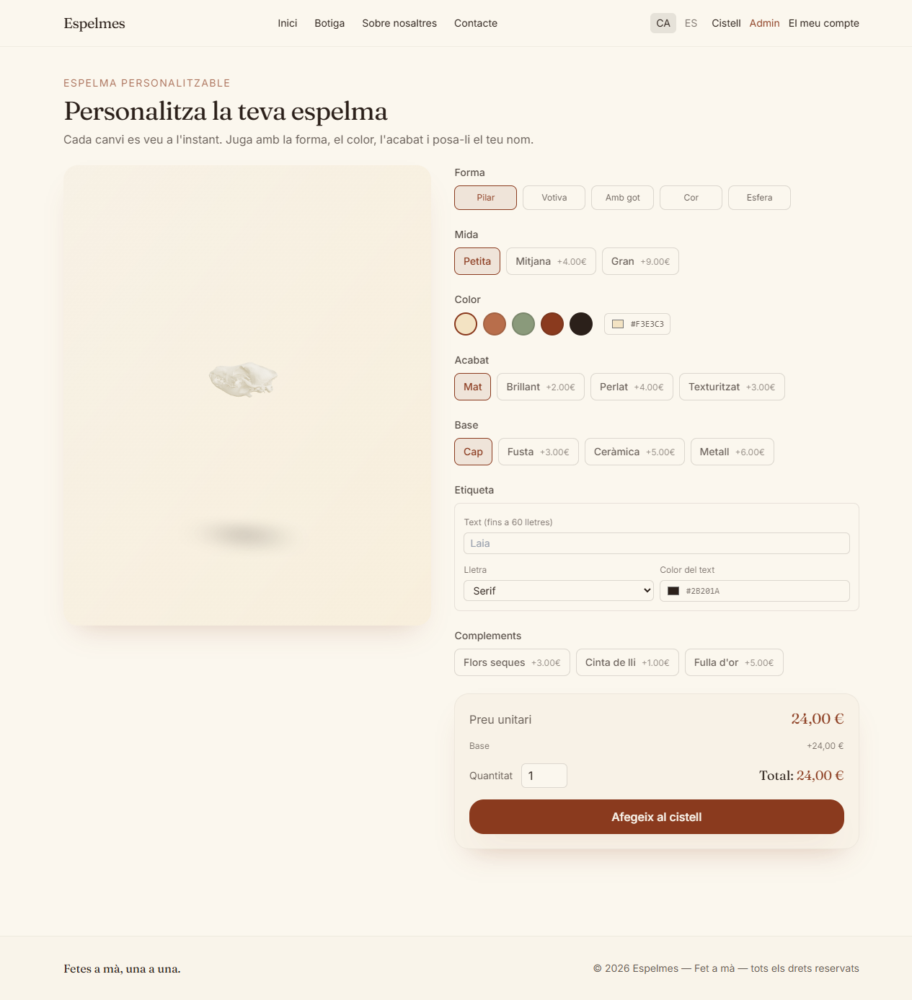
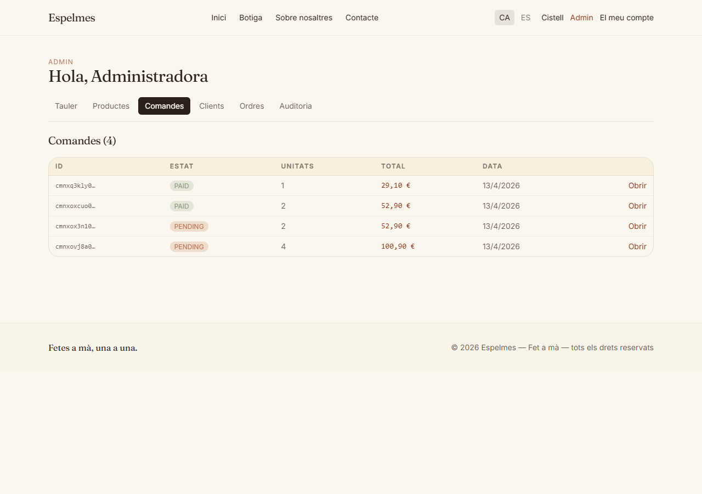
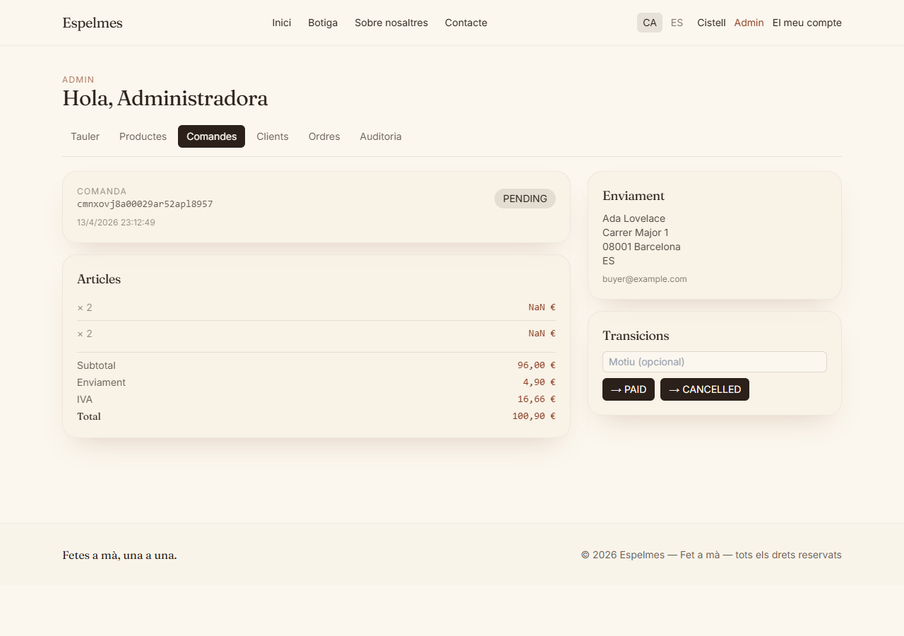

# Guia per gestionar la botiga

Guia pensada per la Mare. Explica pas a pas com afegir espelmes a la web, com
generar models 3D, i com gestionar comandes. No cal saber informàtica — només
llegir i clicar.

> **Nota sobre les captures de pantalla**: els forats `![captura: ...]` més
> avall són placeholders. Les imatges reals han de ser desades a
> `docs/img/guia/` amb els noms indicats. Veure la llista al final del
> document.

## Com entrar al panell d'administració

1. Obre el navegador i ves a la web.
2. Clica **"El meu compte"** a dalt a la dreta (si no hi és, ves a `/ca/auth/login`).
3. Entra amb les teves credencials d'administradora.
4. Apareixerà un enllaç **"Admin"** al menú de dalt. Clica-hi.





Si no veus l'enllaç "Admin" després d'entrar, és que has entrat amb un compte
de client normal. Demana al Guillem que et doni accés d'administradora.

---

## Afegir una espelma nova a la botiga

Ves a **Admin → Productes → + Nou producte**.



Omple els camps:

| Camp | Què posar-hi |
| --- | --- |
| **Nom** | El nom que verà el client. Ex: *"Espelma de rosa seca"*. |
| **Slug** | El nom curt per l'URL. Només lletres minúscules, números i guions. Ex: `espelma-rosa-seca`. Si no saps què posar, fes el nom en minúscules amb guions. |
| **Categoria** | Escull de la llista. Si necessites una nova, ves a **Admin → Categories** abans. |
| **Preu base (cèntims)** | El preu en **cèntims**, no en euros. Per 24,50 € escriu `2450`. Per 10 € escriu `1000`. |
| **Estoc** | Quantes unitats en tens. |
| **IVA** | `0.21` per l'IVA espanyol normal (21%). No ho toquis si no saps. |
| **Descripció curta** | Una frase que surt a la targeta del catàleg. |
| **Descripció** | El text llarg que surt a la pàgina del producte. Pots explicar la història, els materials, la durada de l'espelma, etc. |
| **URL imatge hero** | Enllaç a una foto del producte. Si no en tens cap, deixa-ho buit i utilitza només el model 3D. |
| **Model 3D** | Veure secció següent. |
| **Personalitzable** | Activat si el client pot canviar colors, mides, etc. al configurador. |
| **Actiu** | Activat perquè aparegui a la botiga. Si el desactives, es queda amagat però no esborrat. |



Clica **"Crear producte"**. Ja apareix a la botiga.

### Editar una espelma existent

**Admin → Productes → clica el nom del producte**. Canvia el que vulguis, clica
**"Desa canvis"**.

### Amagar una espelma sense esborrar-la

Al formulari d'edició, clica **"Desactivar"**. Desapareix del catàleg però les
comandes antigues es conserven. Si canvies d'opinió, edita el producte i
torna a activar **"Actiu"**.

---

## Com generar un model 3D d'una espelma

Els models 3D es generen **fora de la web** amb una eina gratuïta, i després
es pugen al producte. Recomanació: **Meshy** (meshy.ai) — té pla gratuït
suficient per començar.

### Pas 1 — Fer fotos a l'espelma

- Posa l'espelma sobre un fons pla d'un sol color (blanc, gris, negre).
- Llum natural o uniforme, sense ombres dures.
- Fes **4 fotos** des de diferents angles: davant, costat, darrere, i una mica
  des de dalt.
- Evita fons amb objectes o textures — com més net, millor.

### Pas 2 — Generar el model amb Meshy

1. Ves a [meshy.ai](https://meshy.ai) i crea un compte gratuït.
2. Clica **"Image to 3D"**.
3. Puja una de les fotos (la millor — la del davant sol funcionar).
4. Espera ~1–2 minuts. Meshy t'ofereix 4 variants.
5. Tria la que s'assembla més a la teva espelma real.
6. Clica **"Download"** i tria el format **`.glb`**.


Si cap variant t'agrada, prova amb una altra foto o amb el pla de pagament
(~20 €/mes) que dona resultats millors.

### Pas 3 — Pujar el model al producte

1. Al panell d'admin, obre el producte (**Productes → clica el nom**).
2. Baixa fins a la secció **"Model 3D (.glb)"**.


3. Clica **"Tria fitxer"** i selecciona el `.glb` que t'has descarregat.
4. Espera uns segons (apareix "Pujant…").
5. Quan acabi, veuràs l'URL del model pujat.
6. **Escala**: si el model es veu massa gran o petit al configurador, ajusta
   aquest valor. Comença amb `1`. Si es veu gegant, prova `0.1` o `0.5`. Si
   es veu minúscul, prova `5` o `10`.
7. **Desplaçament Y**: si el model "flota" o es "soterra", ajusta això.
   Números positius pugen el model; negatius el baixen. Prova valors petits
   (`0.1`, `-0.1`, etc.).
8. Clica **"Desa canvis"**.

Comprova el resultat: ves a la pàgina del producte i clica **"Personalitza
aquesta"**. Si el model es veu bé, perfecte. Sinó, torna a l'admin i ajusta
escala/desplaçament.



### Com eliminar un model 3D

Al formulari, secció "Model 3D", clica **"Eliminar"** al costat de l'URL.
Desa. El producte tornarà a mostrar el mode 2D.

---

## Gestionar comandes

**Admin → Comandes**.

Veuràs la llista de les comandes recents amb el seu estat (color diferent per
cada estat). Clica una comanda per veure el detall: què ha comprat el client,
com ho ha personalitzat, i l'adreça d'enviament.





### Estats de comanda i què vol dir cadascun

- **PENDING** — S'ha fet la comanda però no s'ha cobrat.
- **PAID** — Ja s'ha pagat. Cal preparar-la.
- **FULFILLED** — Ja està preparada i empaquetada.
- **SHIPPED** — S'ha enviat al transportista.
- **DELIVERED** — El client ha rebut la comanda.
- **CANCELLED** — La comanda s'ha cancel·lat.
- **REFUNDED** — S'ha retornat el diner al client.

### Com canviar l'estat

Al detall de la comanda, a dalt hi ha botons amb els **estats als quals pots
transicionar**. El sistema només mostra els vàlids — no pots tornar enrere ni
saltar-te passos. Flux normal:

```
PENDING → PAID → FULFILLED → SHIPPED → DELIVERED
```

Si el client vol cancel·lar abans de pagar: PENDING → CANCELLED.
Si vol un reemborsament després de pagar: qualsevol → REFUNDED (això
restaura l'estoc automàticament).

---

## Què fer si…

**…un client em diu que la foto del producte no es veu bé**
Edita el producte i canvia l'**URL imatge hero** per una nova foto, o puja un
model 3D millor.

**…vull canviar el preu de totes les espelmes alhora**
Ves a **Admin → Ordres → "recalculate-pricing"**. Posa un multiplicador (ex:
`1.05` per pujar un 5%). **Prova sempre primer amb `dryRun: true`** per veure
quins productes afectaria sense canviar res. Si queda bé, torna a executar
amb `dryRun: false`.

**…em arriba una comanda duplicada**
Les comandes tenen un ID únic. Si el client es queixa, comprova a **Admin →
Comandes** si hi ha dues amb el mateix nom i import similar. Una de les dues
deu estar en `PENDING` (no pagada). Cancel·la la duplicada.

**…no em funciona alguna cosa**
Truca al Guillem. Revisar què ha passat és fàcil: a **Admin → Auditoria** hi
ha el registre de totes les accions fetes al panell, amb data i actor.

---

## Seguretat bàsica

- **No comparteixis mai el teu email/contrasenya d'admin.** Si algú més
  necessita entrar, que tingui el seu propi compte admin.
- **No facis captures de pantalla del panell d'admin amb comandes dels
  clients.** Conté dades personals.
- **Si et sembla que algú ha entrat al teu compte**, digues al Guillem
  immediatament perquè canviï la contrasenya i revisi l'auditoria.

---

## Apèndix — captures que falten

Aquesta guia té 10 placeholders per captures de pantalla. Cal fer-les amb la
web en funcionament i desar-les a `docs/img/guia/` amb els noms exactes
indicats. Amplada recomanada: 1200px. Format: PNG.

| Nom de fitxer | Què ha de mostrar |
| --- | --- |
| `01-header-admin.png` | Header de la web amb l'enllaç "Admin" visible (captura només de la barra superior). |
| `02-admin-dashboard.png` | Pantalla `/ca/admin/dashboard` amb les KPIs visibles. |
| `03-productes-llista.png` | Pantalla `/ca/admin/products` amb el botó **+ Nou producte** ben visible a dalt a la dreta. |
| `04-formulari-producte.png` | Formulari de creació/edició de producte sencer (`/ca/admin/products/new`), amb tots els camps. Pot ser una captura alta (scroll complet). |
| `05-meshy-variants.png` | Pantalla de Meshy amb les 4 variants 3D generades a partir d'una foto d'espelma. |
| `06-meshy-descarrega.png` | Menú de descàrrega de Meshy amb l'opció `.glb` seleccionada o destacada. |
| `07-seccio-model-3d.png` | Zoom a la secció **Model 3D (.glb)** del formulari d'admin, mostrant el botó de pujar fitxer + camps d'escala i desplaçament Y. |
| `08-configurador-3d.png` | Pantalla del configurador (`/ca/personalitza/<slug>`) amb el model 3D renderitzat correctament a l'esquerra i els controls a la dreta. |
| `09-comandes-llista.png` | Pantalla `/ca/admin/orders` amb comandes d'exemple amb diferents estats acolorits. |
| `10-comanda-detall.png` | Detall d'una comanda amb articles, personalització (JSON), adreça i els botons de transició d'estat. |

Per fer-les: arrenca la web en local, fes login com a admin, ves a cada
pantalla, i fes captura amb l'eina de retall de Windows (`Win+Shift+S`) o
amb l'eina de captura del navegador (F12 → Command Menu → "Capture full
size screenshot").
